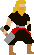
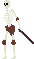
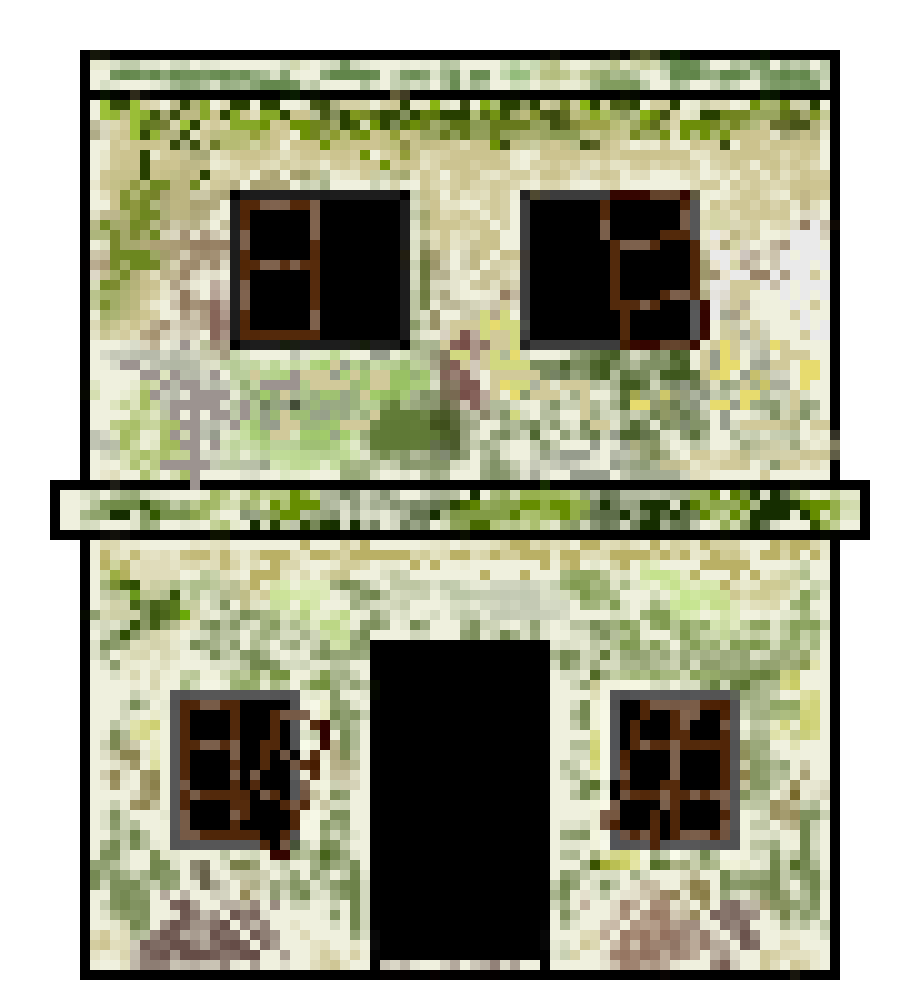

# Godgame (Unity WebGL)

**Spil nu**: [mette.gf2.dk/godgame](https://mette.gf2.dk/godgame)

[](https://mette.gf2.dk/godgame)

> Unity-spil lavet på Askov Højskole. Repoet indeholder både Unity-projektet **og** en færdig WebGL-build, der kan serveres med Nginx (via Docker).

---

## Billeder fra `Assets/`

<p>
  
  
  
</p>

<details>
  <summary>Flere sprites</summary>
  <p>
    
    
    
  </p>
</details>

---

## Overblik

| Hvor? | URL | Hvad? |
|---|---|---|
| **Hostet** | `https://mette.gf2.dk/godgame` | Produktionsversionen |
| **Lokalt (Docker)** | `http://localhost:19081/` | Root WebGL-build (`index.html` + `Build/`) |
| **Lokalt (Docker)** | `http://localhost:19081/Web/` | Sekundær WebGL-build (alternativ) |

---

## Gameplay

- **Spilbare figurer**: skift mellem 3 figurer (se `GodManager`).
- **Bevægelse og angreb**: angreb har cooldown og rammer fjender inden for en radius (se `Gods`).
- **Vinderbetingelse**: når alle fjender er besejret, skifter spillet til `WinScene` (se `EnemyManager`).

Scener ligger i `Assets/Scenes/` og inkluderer `Start`, `Dansk`, `English`, `WinScene`, `LoseScene`.

---

## Kør spillet lokalt

### Docker

Kører en Nginx-container der server Unity WebGL-filerne korrekt (inkl. `.wasm.gz`, `.data.gz`, `.js.gz` med korrekte headers).

```bash
docker compose up --build
```

Standardport er **19081**. Porten kan ændres sådan her:

```bash
# Windows PowerShell
$env:GODGAME_PORT=8080; docker compose up --build
```

Åbn:
- `http://localhost:19081/`
- `http://localhost:19081/Web/`

### Statisk hosting (uden Docker)

Ved statisk hosting (Nginx, Caddy, Apache, GitHub Pages, osv.) skal serveren:
- **Serve** `index.html`, `Build/`, `TemplateData/` (og evt. `Web/`)
- **Sætte headers** så Unitys pre-komprimerede filer fungerer:
  - `.wasm.gz` → `Content-Type: application/wasm` + `Content-Encoding: gzip`
  - `.data.gz` → `Content-Type: application/octet-stream` + `Content-Encoding: gzip`
  - `.js.gz` → `Content-Type: application/javascript` + `Content-Encoding: gzip`

Der ligger et eksempel i `nginx-unity.conf` (bruges af `Dockerfile`).

---

## Repo-struktur

- **Unity-projekt**
  - `Assets/` (scripts, sprites, scenes)
  - `ProjectSettings/` (Unity-projektindstillinger)
  - `Packages/` (Unity packages / manifest)
- **WebGL (klar til hosting)**
  - `index.html`, `Build/`, `TemplateData/` (**root build**)
  - `Web/` (**sekundær build**, tilgængelig på `/Web/`)
- **Hosting**
  - `Dockerfile` (Nginx image der kopierer build ind)
  - `docker-compose.yml` (port-mapping + build)
  - `nginx-unity.conf` (vigtige gzip/mime headers til Unity WebGL)

---

## Build (Unity)

Projektet er lavet med:
- **Unity**: `6000.0.47f1`

WebGL-output i repoet matcher de nuværende `index.html`-filer (root og `Web/`). Ved rebuild i Unity skal filnavne/paths fortsat matche (fx loader/data/framework/wasm).

---
